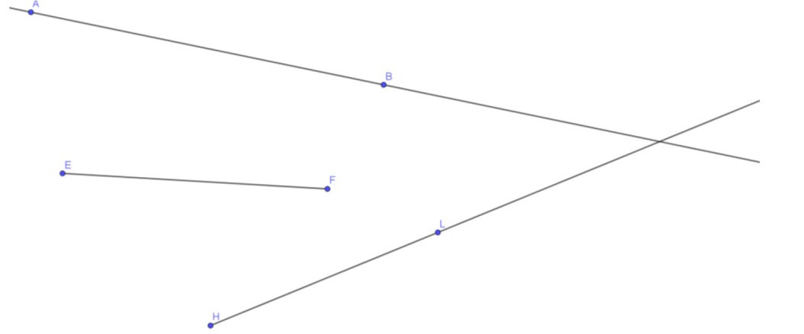
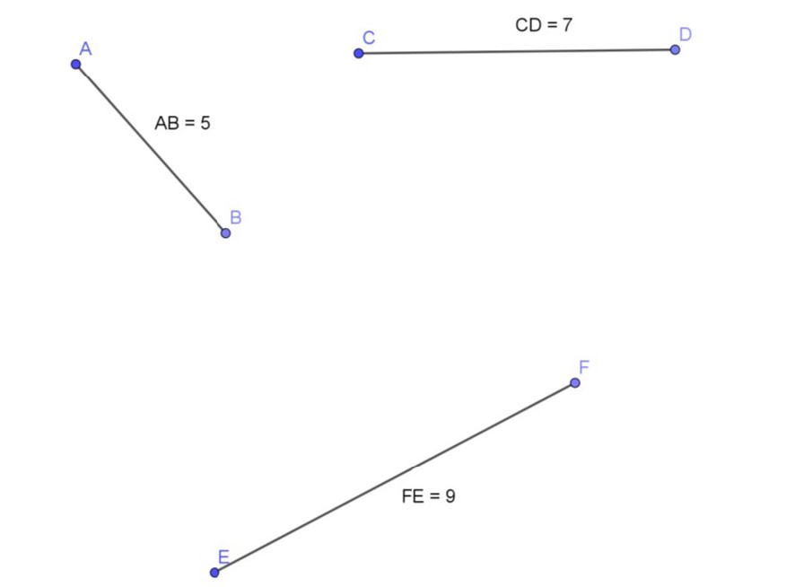
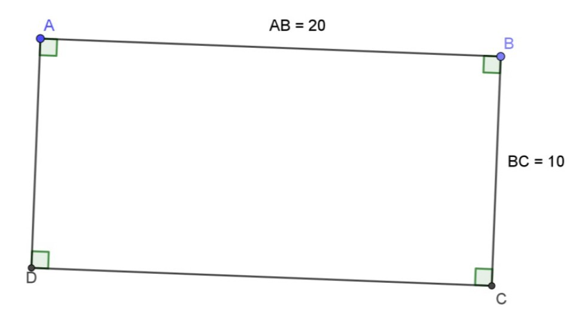
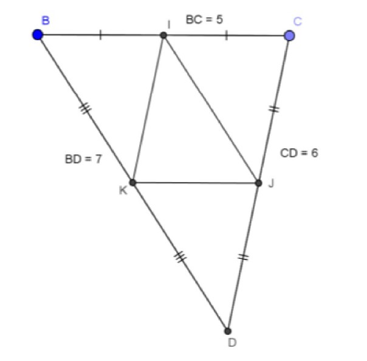
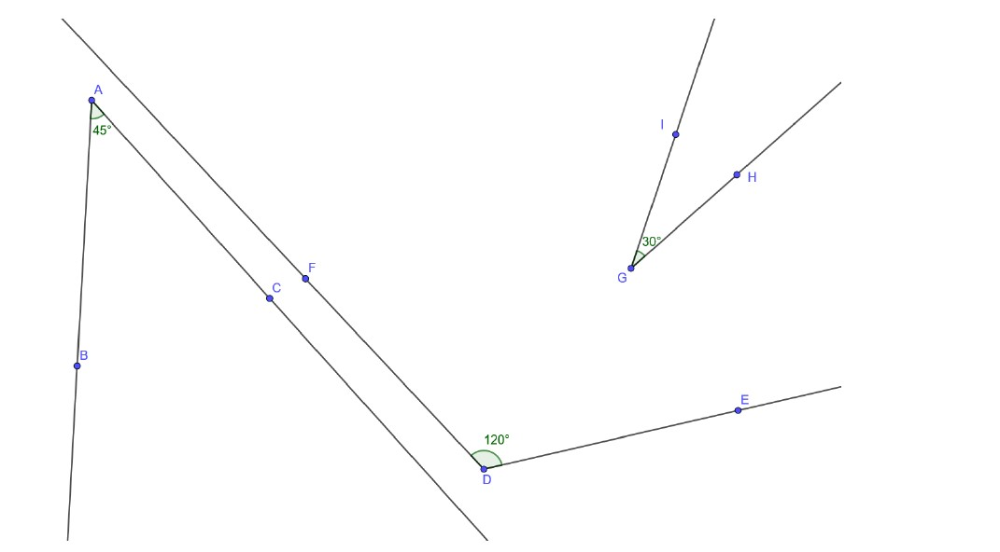
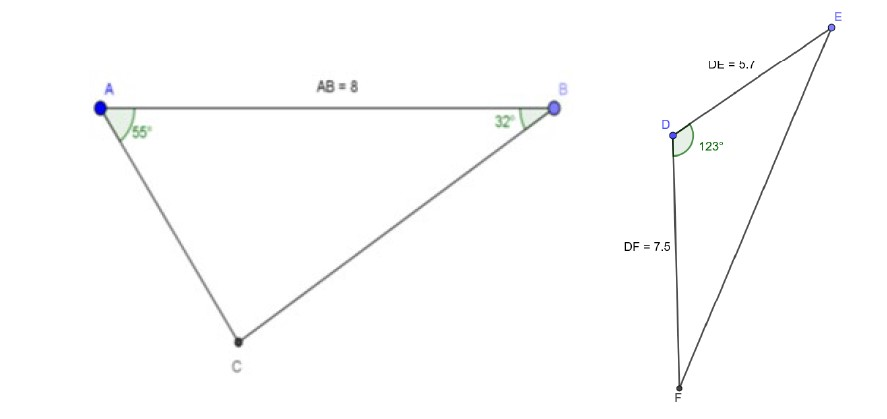
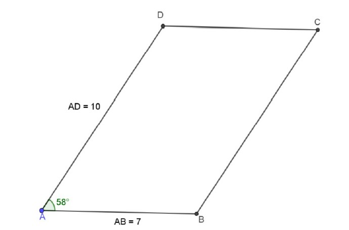
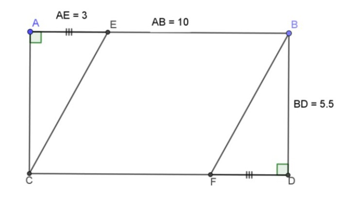

# Geogebra TP 1 : rappel des commandes de base

(20 points)

## Partie 1 : point, segment, droite et demi-droite

* Regarde la vidéo ci-dessous (site web et feuille blanche).

<iframe width="800" height="600" src="https://www.youtube.com/embed/EKuF6DWu0No?rel=0" title="Site web" frameborder="0" allow="accelerometer; autoplay; clipboard-write; encrypted-media; gyroscope; picture-in-picture; web-share" allowfullscreen></iframe>

* Ouvre le navigateur internet et rends-toi sur le site web de Geogebra.  
  Prépare une feuille de dessin blanche.
      
* Regarde la vidéo ci-dessous (points, droites et demi-droites)

<iframe width="949" height="534" src="https://www.youtube.com/embed/UIZrVx7wh7I?rel=0&showinfo=0&controls=1" title="Points droites" frameborder="0" allowfullscreen></iframe>

 * Regarde la vidéo ci-dessous (annuler la dernière action)

<iframe width="800" height="600" src="https://www.youtube.com/embed/qFzO9Ev6dU8?rel=0&showinfo=0&controls=1" title="Annuler derniere action" frameborder="0" allowfullscreen></iframe>

## >> Je m’évalue
### Exercice (2 points)  
* Construis la figure ci-dessous sur la feuille de dessin.  
   
   
* Regarde la vidéo ci-dessous (exportation d’un fichier)

<iframe width="800" height="600" src="https://www.youtube.com/embed/mINNwL5_HkY?rel=0&showinfo=0&controls=1" title="Exporter" frameborder="0" allowfullscreen></iframe>

* Exporte la figure sous le nom nom_prenom_geogebra_TP1_partie1. Enregistre le fichier exporté sur le bureau.

## Partie 2 : perpendiculaires
* Regarde la vidéo ci-dessous (construire une perpendiculaire).

<iframe width="800" height="600" src="https://www.youtube.com/embed/8OC14kupdrk?rel=0&showinfo=0&controls=1" title="Perpendiculaire" frameborder="0" allowfullscreen></iframe>

## >> Je m’évalue
### Exercice (2 points)  
* Regarde la vidéo ci-dessous.

<iframe width="800" height="600" src="https://www.youtube.com/embed/MeFBmpFhydQ?rel=0&showinfo=0&controls=1" title="Utilisation liens" frameborder="0" allowfullscreen></iframe>

1. Comme expliqué dans la vidéo de la question 1, clique sur le lien suivant [fichier](https://www.geogebra.org/m/ety2efsc).

2. Sur la feuille qui vient de s’ouvrir, trace les droites perpendiculaires à la droite (AB) passant par les points C, D, E, F, G, H et I.

3. Exporte le fichier sous le nom nom_prenom_geogebra_TP1_partie2. Enregistre le fichier exporté sur le bureau.

## Partie 3 : parallèles
* Regarde la vidéo ci-dessous (construire une parallèle).

<iframe width="800" height="600" src="https://www.youtube.com/embed/wwIgRwPQ5RU?rel=0&showinfo=0&controls=1" title="Parallèles" frameborder="0" allowfullscreen></iframe>

## >> Je m’évalue
### Exercice (2 points)  
1. Comme expliqué dans la vidéo de tout à l'heure, clique sur le lien suivant [fichier](https://www.geogebra.org/m/juhjpkgk).

2. Tracer les droites parallèles à la droite (AB) passant par les points C, D, E et F.

3. Exporte le fichier sous le nom nom_prenom_geogebra_TP1_partie3.

4. Enregistre le fichier exporté sur le bureau.

## Partie 4 : segment de longueur donnée et codage de longueur
* Regarde la vidéo ci-dessous (nouvelle feuille de dessin).

<iframe width="800" height="600" src="https://www.youtube.com/embed/dOUsKunZcYc?rel=0&showinfo=0&controls=1" title="Nouvelle feuille" frameborder="0" allowfullscreen></iframe>

* Regarde la vidéo ci-dessous (construire un segment de longueur donnée et afficher la longueur de ce segment).

<iframe width="800" height="600" src="https://www.youtube.com/embed/-7fQnAqs4MM?rel=0&showinfo=0&controls=1" title="Segment" frameborder="0" allowfullscreen></iframe>

## >> Je m’évalue
### Exercice (2 points)  
1. Construis la figure ci-dessous sur une nouvelle feuille de dessin.  
   

2. Vérifie que la figure est correcte en déplaçant les points.

3. Exporte le fichier sous le nom nom_prenom_geogebra_TP1_partie4.

4. Enregistre le fichier exporté sur le bureau.

## Partie 5 : rectangle et codage de l’angle droit
* Regarde la vidéo ci-dessous (construction d’un rectangle et codage des angles droits)

<iframe width="800" height="600" src="https://www.youtube.com/embed/tuVIzzIxAu4?rel=0&showinfo=0&controls=1" title="Rectangle" frameborder="0" allowfullscreen></iframe>

## >> Je m’évalue
### Exercice (2 points)  
1. Sur une nouvelle feuille de dessin, construis le rectangle ci-dessous et affiche le codage.  
   

2. Vérifie que la figure est correcte en déplaçant les points.

3. Exporte le fichier sous le nom nom_prenom_geogebra_TP1_partie5.

4. Enregistre le fichier exporté sur le bureau.

## Partie 6 : milieu et codage du milieu
* Regarde la vidéo ci-dessous (placer le milieu d’un segment puis coder ce milieu).

<iframe width="800" height="600" src="https://www.youtube.com/embed/WwKx5wlbCI8?rel=0&showinfo=0&controls=1" title="Milieu" frameborder="0" allowfullscreen></iframe>

* Regarde la vidéo ci-dessous (construction d’un triangle dont on connaît les longueurs des trois côtés).

<iframe width="800" height="600" src="https://www.youtube.com/embed/eRSuGzrsN0Y?rel=0&showinfo=0&controls=1" title="Triangle 3cotes" frameborder="0" allowfullscreen></iframe>

## >> Je m’évalue
### Exercice (2 points)  
1. Sur une nouvelle feuille de dessin, construis la figure ci-dessous :
  &diams; en commençant par construire le triangle BCD ;
  &diams; place ensuite les milieux I, J et K ;
  &diams; effectue le codage.  

   

2. Vérifie que la figure est correcte en déplaçant les points.

3. Exporte le fichier sous le nom nom_prenom_geogebra_TP1_partie6.  
   Enregistre le fichier sur le bureau.

## Partie 7 : angles
* Regarde la vidéo ci-dessous (construction d'angles)

<iframe width="800" height="600" src="https://www.youtube.com/embed/uipmwPfyqj0?rel=0&showinfo=0&controls=1" title="Angles" frameborder="0" allowfullscreen></iframe>

## >> Je m’évalue
### Exercice (2 points)  
1. Sur une nouvelle feuille de dessin, construis la figure ci-dessous et affiche le codage.  
   

2. Vérifie que la figure est correcte en déplaçant les points.

3. Exporte le fichier sous le nom nom_prenom_geogebra_TP1_partie7.  
   Enregistre le fichier sur le bureau.

## Partie 8 : triangles
* Regarde la vidéo ci-dessous (construction de triangles ; deux longueurs encadrent une mesure d'angle)

<iframe width="800" height="600" src="https://www.youtube.com/embed/HQNRhvnjAMw?rel=0&showinfo=0&controls=1" title="Triangle 2cotes 1angle" frameborder="0" allowfullscreen></iframe>

* Regarde la vidéo ci-dessous (construction de triangles ; deux mesures d'angles encadrent une longueur)

<iframe width="800" height="600" src="https://www.youtube.com/embed/hQy0RwsLzoU?rel=0&showinfo=0&controls=1" title="Triangle 1cote 2angles" frameborder="0" allowfullscreen></iframe>

## >> Je m’évalue
### Exercice (2 points)  
1. Sur une nouvelle feuille de dessin, construis les deux triangles ci-dessous et affiche le codage.  
   

2. Vérifie que la figure est correcte en déplaçant les points.

3. Exporte le fichier sous le nom nom_prenom_geogebra_TP1_partie8.  
   Enregistre le fichier sur le bureau.

## Partie 9 : parallélogramme
* Regarde la vidéo ci-dessous (construction d’un parallélogramme)

<iframe width="800" height="600" src="https://www.youtube.com/embed/M7nIvdgkrvw?rel=0&showinfo=0&controls=1" title="Parallelogramme" frameborder="0" allowfullscreen></iframe>

## >> Je m’évalue
### Exercice (2 points)  
1. Sur une nouvelle feuille de dessin, construis la figure ci-dessous et affiche le codage.  
   

2. Vérifie que la figure est correcte en déplaçant les points.

3. Exporte le fichier sous le nom nom_prenom_geogebra_TP1_partie9.  
   Enregistre le fichier sur le bureau.

## Partie 10 : ordre de construction
* Regarde la vidéo ci-dessous (ordre de construction)

<iframe width="800" height="600" src="https://www.youtube.com/embed/mJ8gyhRBenE?rel=0&showinfo=0&controls=1" title="Ordre construction" frameborder="0" allowfullscreen></iframe>

## >> Je m’évalue
### Exercice (2 points)  
1. Sur une nouvelle feuille de dessin, construis la figure ci-dessous. Affiche le codage.  
   

2. Vérifie que la figure est correcte en déplaçant les points.

3. Exporte le fichier sous le nom nom_prenom_geogebra_TP1_partie10.  
   Enregistre le fichier sur le bureau.
